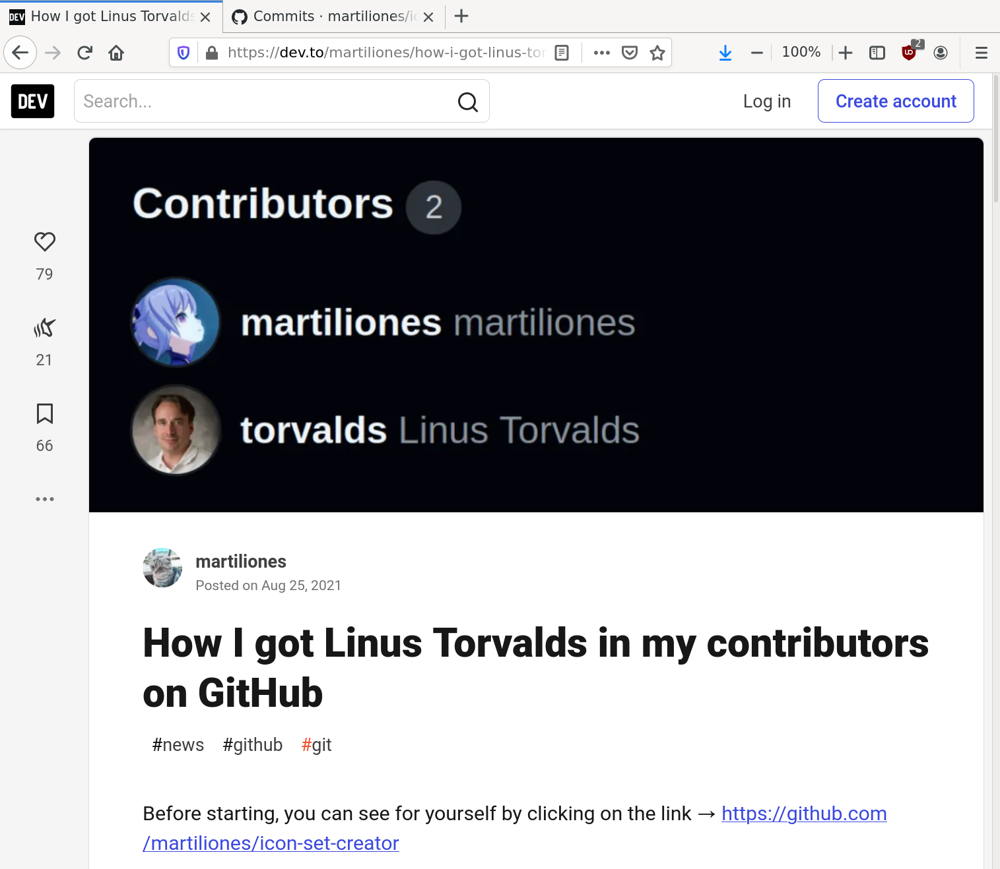

# Authenticate Commits

## Introduction

A version control system like `git` doesn't just track changes, it
also provides a record of who made those changes.  This information
can be used to check that commits are authorized, which can improve
software supply chain security.  In particular, checking a change's
provenance can be used to remove intermediaries like forges, and
package registries from a user's trusted computing base.  But,
[authorship information can easily be
forged](https://dev.to/martiliones/how-i-got-linus-torvalds-in-my-contributors-on-github-3k4g).



An obvious solution to prevent forgeries would be to require that
commits are digitally signed.  But by itself a valid digital signature
doesn't prevent forgeries.  The certificate that was used to make the
signature could claim to be one of the project's maintainers.  What is
needed is not only a list of entities who are allowed to modify the
repository, *but also* the keys they use to sign the commits.  In
other words, to authenticate a commit we need a signing policy, which
says what keys are authorized to make changes.

Creating a policy isn't complicated.  A project's maintainers could
curate a list of entities who are allowed to add commits, and
enumerate the certificates they use to sign them.  The tricky part is
applying the policy.  There are a number of edge cases that need to be
handled like how merge changes from external contributions, who is
allowed to change the policy, and how to deal with compromised keys.

[Sequoia git](https://gitlab.com/sequoia-pgp/sequoia-git) is a project
that [specifies a set of
semantics](https://sequoia-pgp.gitlab.io/sequoia-git/), defines a
policy language, and provides a set of tools to manage a policy file,
and authenticate commits.

Using Sequoia git is relatively straightforward.  You start by adding
a policy file, `openpgp-policy.toml`, to your project's repository.
The policy is maintained in band to allow it to evolve, just like the
rest of the project.  The `openpgp-policy.toml` file is basically a
list of OpenPGP certificates and the type of changes they are
authorized to make.  [`sq-git` can help you create
it](https://gitlab.com/sequoia-pgp/sequoia-git#deploying-sq-git).

Then, before you merge a pull request, you check that commits are
authorized by the policy.  Locally, this is done by running `sq-git
log` on the range of commits that you want to push.  A commit is
considered authorized if the commit has a valid signature, and at
least one immediate parent's policy allows the signer to make that
type of change.  Projects hosted on GitHub can use this action to
automatically check that a pull request is authorized when it is
opened, or updated.

Downstream users can use Sequoia git to check that there is a chain of
trust from an older, known-good version of the software to a new
version.  This helps prevent the use of versions that include
modifications that weren't authorized by the project's maintainers.

See the [project's
documentation](https://gitlab.com/sequoia-pgp/sequoia-git/-/blob/main/README.md)
for more details.

## The `authenticate-commits` Action

To use Sequoia git, you'll need to sign all of your commits.  You can
configure `git` to always sign your commits as follows:

```shell
$ git config --global user.signingkey AACB3243630052D9
$ git config --global commit.gpgsign true
```

See also [GitHub's
guide](https://docs.github.com/en/authentication/managing-commit-signature-verification/telling-git-about-your-signing-key).

You then add a policy file (`openpgp-policy.toml`) to the root of your
git repository The policy file authorizes OpenPGP certificates to make
different types of changes.  For example:

```shell
$ sq-git policy authorize  --project-maintainer "Neal H. Walfield <neal@pep.foundation>" AACB3243630052D9
$ git add openpgp-policy.toml
$ git commit -m 'Add signing policy.'
$ git push origin main:signing-policy
$ # Merge via a pull request.
```

A committer (`--committer`) is authorized to add changes to the
repository; a release manager (`--release-manager`) is also authorized
to sign tags and archives; and, a project maintainer
(`--project-maintainer`) can authorize and retire users, and good list
commits.

Before you merge a change you run `sq-git log` to make sure it is
authorized.  Add this workflow to
`.github/workflows/authenticate-commits.yml` to run `sq-git` whenever
a pull request is opened or updated:

```yaml
name: authenticate-commits
on:
  pull_request:
    types: [opened, reopened, synchronize]
jobs:
  authenticate-commits:
    runs-on: ubuntu-latest

    permissions:
      contents: read
      pull-requests: write
      issues: write

    steps:
      - name: Authenticating commits
        uses: sequoia-pgp/authenticate-commits@main
```

The workflow's results are posted as a comment on the pull request.

## Merging Pull Requests

GitHub's web UX provides three different strategies for merging a pull
request.


Unfortunately, none of them are compatible with Sequoia git, because
all three merge strategies modify the pull request in some way.  In
particular, even `Rebase and merge` [unconditionally rewrites the
commits by changing each commit's `committer`
field](https://docs.github.com/en/repositories/configuring-branches-and-merges-in-your-repository/configuring-pull-request-merges/about-merge-methods-on-github#rebasing-and-merging-your-commits).
That is, it does the equivalent of `git rebase --no-ff`.  This results
in the commits having a different hash, and destroys any signatures.

With a bit of work, it is possible to prevent GitHub from modifying
the commits.  Specifically, it is possible to push changes from a pull
request directly to the target branch after any checks have passed.
Consider:

```shell
$ # We can't directly push to main, because it is protected.
$ git push origin
...
remote: error: GH006: Protected branch update failed for refs/heads/main.
...
$ # We can create a PR, wait for the CI checks to pass, then push directly to main.
$ git push origin HEAD:workwork
$ git push origin
```

But, this approach isn't very convenient.

The
[`sequoia-pgp/fast-forward`](https://github.com/sequoia-pgp/fast-forward)
action improves the situation a bit by making it possible to fast
forward directly from the web UX by posting a comment containing
`/fast-forward` to the pull request.

Add `.github/workflows/pull_request.yml` to your repository to check
that whenever a pull request is opened or updated it can be fast
forwarded:

```yaml
name: pull-request
on:
  pull_request:
    types: [opened, reopened, synchronize]
jobs:
  check-fast-forward:
    runs-on: ubuntu-latest

    permissions:
      contents: read
      # We appear to need write permission for both pull-requests and
      # issues in order to post a comment to a pull request.
      pull-requests: write
      issues: write

    steps:
      - name: Checking if fast forwarding is possible
        uses: sequoia-pgp/fast-forward@v1
        with:
          merge: false
          # To reduce the workflow's verbosity, use 'on-error'
          # to only post a comment when an error occurs, or 'never' to
          # never post a comment.  (In all cases the information is
          # still available in the step's summary.)
          comment: always
```

And, to actually fast-forward a branch from the GitHub UX, add
`.github/workflows/fast-forward.yml` to your repository with the
following contents:

```yaml
name: fast-forward
on:
  issue_comment:
    types: [created, edited]
jobs:
  fast-forward:
    # Only run if the comment contains the /fast-forward command.
    if: ${{ contains(github.event.comment.body, '/fast-forward')
            && github.event.issue.pull_request }}
    runs-on: ubuntu-latest

    permissions:
      contents: write
      pull-requests: write
      issues: write

    steps:
      - name: Fast forwarding
        uses: sequoia-pgp/fast-forward@v1
        with:
          merge: true
          # To reduce the workflow's verbosity, use 'on-error'
          # to only post a comment when an error occurs, or 'never' to
          # never post a comment.  (In all cases the information is
          # still available in the step's summary.)
          comment: always
```

This workflow is run when a comment that includes `/fast-forward` is
added to the pull request.  The workflow is careful to check that the
user who triggered the workflow is actually authorized to push to the
repository.
